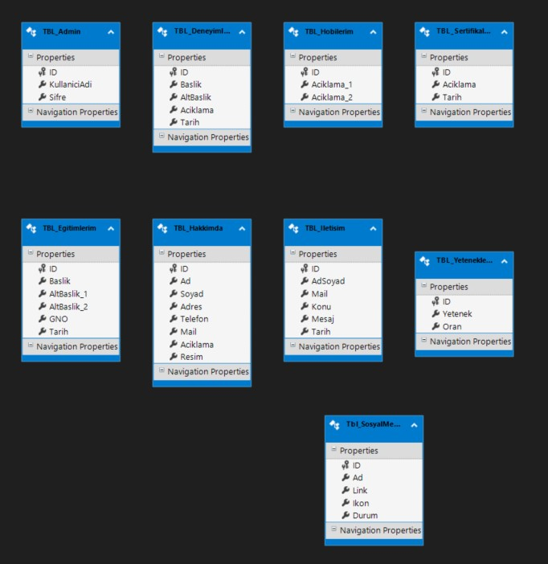
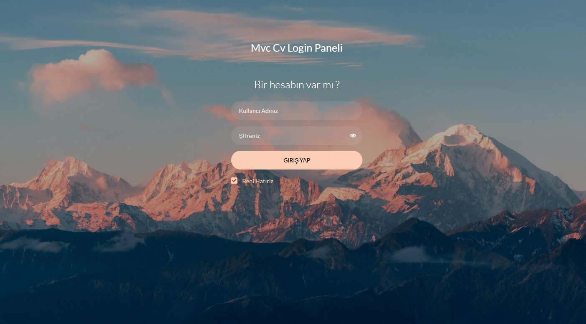
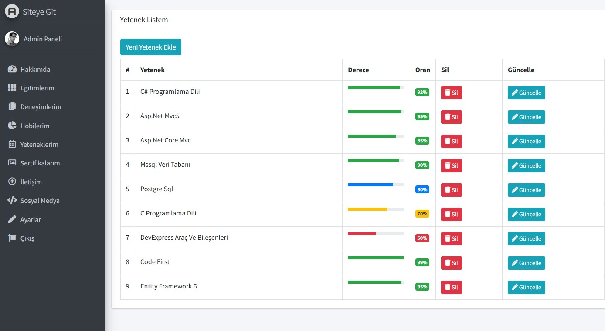
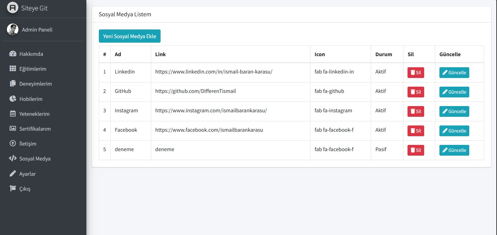
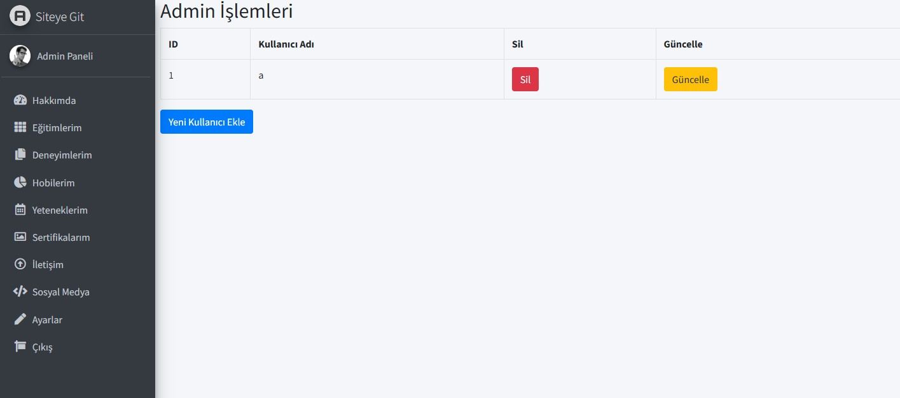
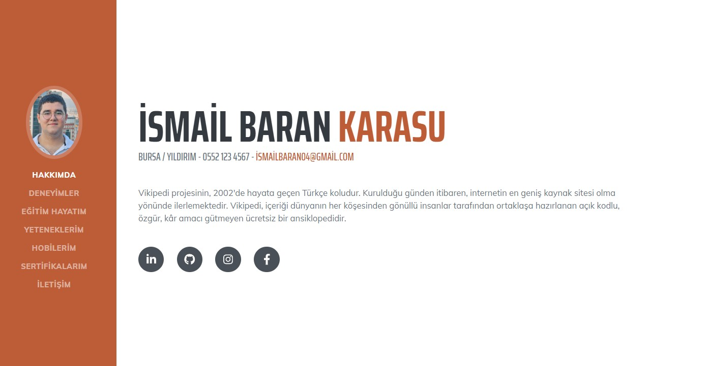
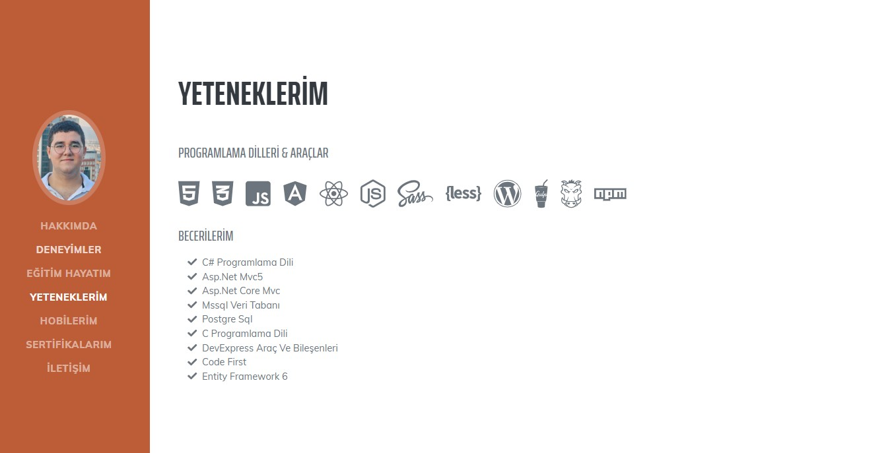
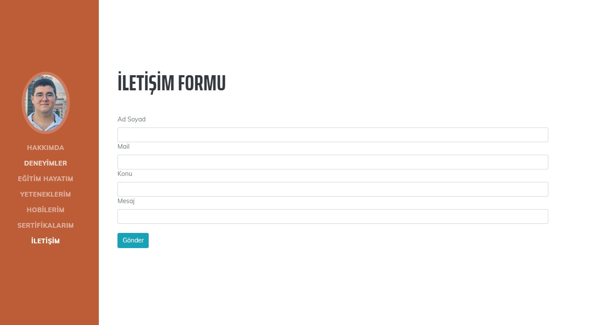

# Mvc5 ile Sıfırdan Admin Panelli Dinamik CV Sitesi 💼

Bu proje, **ASP.NET MVC 5** kullanılarak sıfırdan geliştirilen bir dinamik CV sitesi uygulamasıdır. Kullanıcılar, kendilerine ait bilgileri ekleyerek özelleştirilmiş bir CV oluşturabilirler. Ayrıca, yönetici paneli üzerinden içerik yönetimi yapılabilir. 🛠️

## Özellikler

- **ASP.NET MVC 5:** Dinamik CV yönetimi sağlayan güçlü bir framework. 🏗️
- **Entity Framework:** Veritabanı işlemleri için kullanıldı. 💾
- **SQL Server:** Veritabanı yönetimi. 🗄️
- **Bootstrap:** Responsive tasarım ile kullanıcı dostu arayüz. 📱
- **Authentication:** Kullanıcı girişi ve yönetici oturumu mevcut. 🔑
- **Admin Paneli:** CV içeriklerini ekleme, silme, güncelleme ve listeleme özellikleri. 🛠️
- **Partial View Kullanımı:** Kodun tekrar kullanılabilirliğini artırmak için. 🔄

## Kullanılan Teknolojiler

- **ASP.NET MVC 5** 🖥️
- **Entity Framework** 🔗
- **SQL Server** 🗃️
- **Bootstrap** 🎨
- **Repository Design Pattern** 🗂️
- **JavaScript, HTML, CSS** 🖋️

## Ekran Görüntüleri

### Veri Tabanı


### Login Sayfası


### Admin Paneli Görüntüsü




### UI Sayfaları




## Kurulum

1. Bu projeyi yerel makinenize klonlayın:
   ```bash
   git clone https://github.com/DifferenTismail/mvc-ile-cv.git

2. Proje klasörüne gidin:
    ```bash
    cd mvc-ile-cv

3. Veritabanı yapılandırmalarını yapın ve SQL Server üzerinde çalıştırın.

4. Uygulamayı çalıştırın:
    ```bash
    dotnet run

## Kullanım

Proje, kullanıcıların CV oluşturmasını ve yönetmesini sağlar. Yönetici paneli üzerinden tüm CV verileri kolayca yönetilebilir. Sisteme giriş yaparak CV'nizi özelleştirin ve yayınlayın.

## Katkıda Bulunma

Katkıda bulunmak isterseniz, lütfen bir **pull request** açın. Her türlü katkı memnuniyetle karşılanır.
